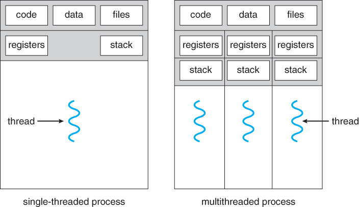
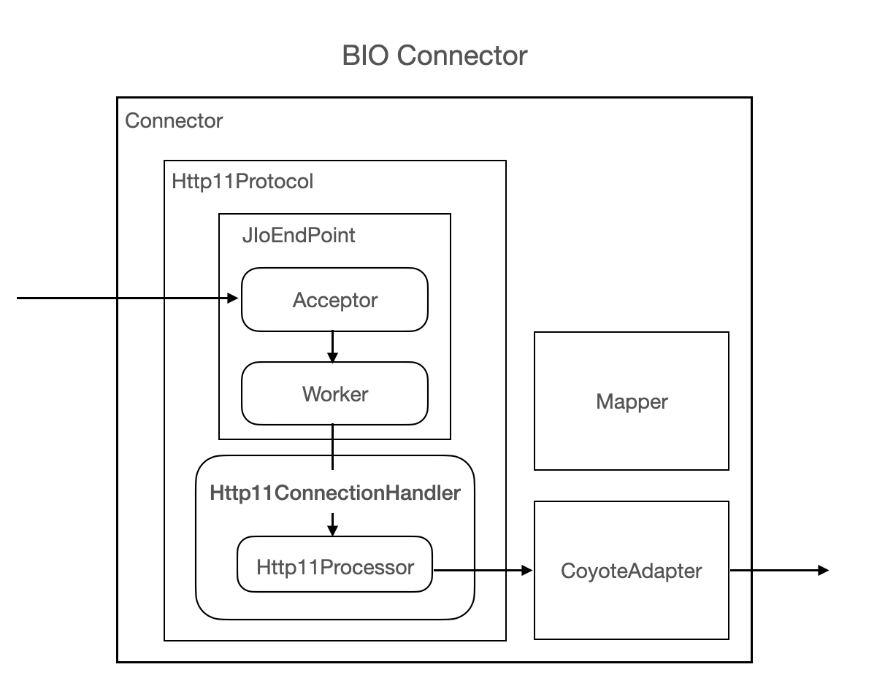
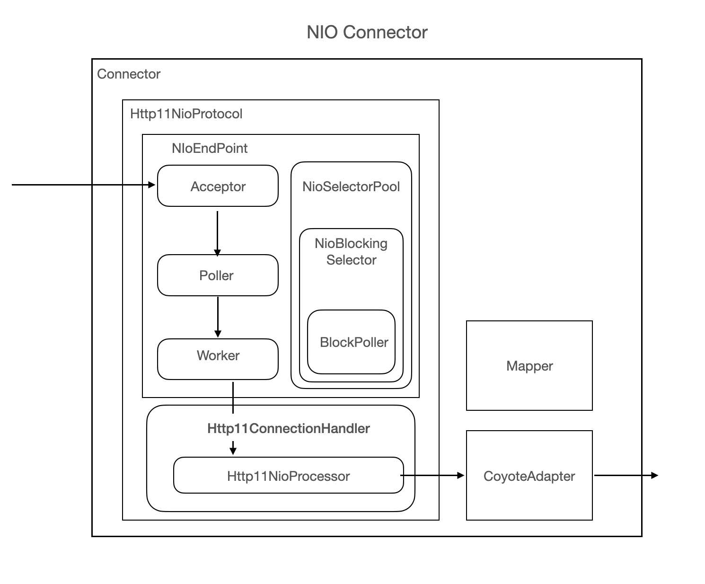

# Thread
한개의 프로세스 내부에서 독립적으로 실행되는 하나의 작업 단위이며 
쓰레드를 활용하여 두가지 이상의 일을 동시에 처리할 수 있다. (엄밀히 말하면 동시처럼 보이지만 동시는 아님)

## Process? Thread?

### Process <sub>프로세스</sub>

 - 실행중인 프로그램; 메모리에 적제되어 CPU의 할당을 받을 수 있다.

### Thread <sub>쓰레드</sub>

 - Process의 실행 단위. 
 - 한 Process 내부에서 동작되는 여러 실행의 흐름.
 - Process의 공간이나 자원을 공유할 수 있다.

<p align="center">
    
</p>

# Java Thread Lifecycle

## Thread Status
```
     ┌────────────┐
     │     New    │ Create Thread  
     └──────┬─────┘
            │  
     ┌──────▼─────┐
     │   Runable  ◀────────────┐
     └──────┬─────┘     ┌──────┴─────┐
            │           │   Blocked  │ (Non-Runnable)
     ┌──────▼─────┐     └──────▲─────┘     
     │   Running  ├────────────┘
     └──────┬─────┘
            │
     ┌──────▼─────┐
     │ Terminator │ 
     └────────────┘
```
 - New : 쓰레드 클래스를 생성했을 때.
 - Runnable : 쓰래드가 준비된 상태
 - Running : 스케줄러에 의해 선택된 쓰래드가 실행
 - Suspended : 동작중인 쓰래드가 일시중지 -> 다시 재개될 수 있음.
 - Blocked : 쓰래드가 대기할 때의 상태 
 - Terminated (Dead) : 쓰래드가 종료됨.

# Java에서 Thread 만들어보기 

Java에서 Thread를 생성하는 방법은 2가지가 있다.

1. <code>Thread</code> 를 상속받아 구현.
2. <code>Runnable</code> Interface를 구현하는 방법

## 1. <code>Thread</code> 를 상속받아 구현.
``` java
public class Sample extends Thread {

    public void run() {
        System.out.println("Run Thread.");
    }
    
}

... 

    Sample thread = new Sample();
    thread.start();
```

## 2. <code>Runnable</code> Interface를 구현하는 방법
``` java
public class Sample extends Runnable {

    public void run() {
        System.out.println("Run Thread.");
    }
    
}

... 

    Thread thread = new Thread( new Sample() );
    thread.start();
```

## Join Member Method

아래 코드와 같이 쓰래드 생성/실행 후 <code>join</code> Method를 사용하면 
쓰래드가 종료되기 전까지 쓰레드가 작동시작한 Method가 종료되지 않는다.

``` java
@Test
void SampleThread_쓰래드_종료_후_함수_종료() throws Exception {
    ArrayList<Thread> threads = new ArrayList<>();
    for(int i = 0; i < 10; i++) {
        Sample sample = new Sample(i);
        sample.start();
        threads.add(sample);
    }

    for(int i = 0; i < 10; i++) {
        Thread t = threads.get(i);
        try {
            t.join();
        } catch (Exception e) {}
    }

    System.out.println("Function Out.");
}
```

위 함수에서 <code>t.join()</code>가 빠진다면 "Function Out" 이라는 문장이 먼저 출력될 것이다.

# Synchronized

Java에서 동기 구현하는데에는 2가지 방식이 있다.

1. Synchronized Method 사용
2. Synchronized Block 사용

## 1. Method 구현

``` java
public synchronized void function() {
    ...
}
```

## 2. Block 구현

``` java
public void function() {

    synchronized(this) {
        ...
    }

}
```

다음 두가지 방식으로 함수에 Synchronized 키워드를 선언하면 해당 함수가 포함된 객체에 Lock을 걸게되어 
쓰레드가 서로서로 영향을 미치는 것을 방지할 수 있다.

## static 함수에서 synchronized

Static Method에 Synchronized 키워드를 정의한다면 Method가 속한 Class 전체가 Lock이 걸리게 된다.

예를 들어
``` java
public class SyncOnStatic {

	private static String someStr;

	public static void toSomething() {
		someStr = "something";
		try {
			long sleep = (long)(Math.random() * 20);
			Thread.sleep(sleep);
			if( !someStr.equals("something") )
				System.out.println("sync broken - something");
		} catch (Exception e) {
			e.printStackTrace();
		}
	}

	public static void toSomeone() {
		someStr = "someone";
		try {
			long sleep = (long)(Math.random() * 10);
			Thread.sleep(sleep);
			if( !someStr.equals("someone") )
				System.out.println("sync broken - someone");
		} catch (Exception e) {
			e.printStackTrace();
		}
	}

}
```

라는 클래스를 생성하고 해당 클래스 내부에 두가지 함수를 각기 다른 쓰레드에서 동시에 실행시킨다면 서로 메모리에 영향을 미치게된다.

``` java
new Thread(()-> {
    for(int i = 0; i < 10000; i++)
        SyncOnStatic.toSomething();
}).start();

new Thread(()-> {
    for(int i = 0; i < 10000; i++)
        SyncOnStatic.toSomeone();
}).start();

--------------------------------------------------
 ( 결과 )
    sync broken - something
    sync broken - someone
    sync broken - something
    sync broken - someone
    sync broken - something
    sync broken - someone
    ...
```

하지만 위 클래스에 다음과 같이 Synchronized 키워드를 붙이게된다면

``` java
public static synchronized void toSomething() {
    ...
}

public static synchronized void toSomeone() {
    ...
}
```

해당 Static Method가 실행되면 그 Method가 속한 Class 전체에 Lock을 걸기때문에 아무런 일이 일어나지 않는다.

** ref : <https://tourspace.tistory.com/54>

# Spring 다중처리

Spring Boot는 Singleton 임에도 불고하고 다중처리가 가능하다. 
이는 내장 서블릿 컨테이너 Tomcat에서 생성된 <code>ThreadPool</code> 덕에 가능한 일이다.

Tomcat은 Thread의 컬렉션인 Thread Pool을 생성한다. 
유저 요청이 들어오면 Thread Pool에서 하나씩 Thread를 할당하여, 할당받은 Thread를 통해 Dispatcher Servlet을 거치게된다.

여기서 할당된 Thread를 통해 Spring은 다중 처리가 가능하게된다. 

### 그럼 여러개의 쓰래드가 하나의 객체(Controller, Service ..)를 사용하는데 성능상 문제는 없을까?
** ref <https://jeong-pro.tistory.com/204> 

만약 Controller 객체를 생성하게 되면 객체는 Heap 영역에 생성되지만 해당 Class의 정보는 Method 영역에 생성된다. 

결국 하나의 객체를 사용하지만 공유 메모리영역의 Method를 사용할 뿐 내부적으로 상태값을 갖지않으니 동기화 할 필요가 없다. 

## Spring Boot의 내장 톰캣
Spring과 달리 Spring Boot는 내장으로 Tomcat을 제공해 준다. 이를 <code>yml</code>이나 <code>application.properties</code>로 쉽게 설정할 수 있다.

``` yml
server:
    tomcat:
        threads:
            max: 200                # 최대 생성 Thread 갯수
            min-spare: 10           # Idle Thread 갯수 (상시 활성화)
            
        max-connections: 8192       # 최대 Connection 갯수
        accept-count: 100           # TaskQueue의 사이즈
        connection-timeout: 20000   # timeout 판단 기준 시간, 20초
```

### max-thread 갯수가 connection 수 아니야 ?

위 글에서 사용자가 몰리면 Thread Pool에서 Thread를 할당하여 해당 Thread로 사용자를 관리한다고 하였다. 
하지만 Tomcat 설정을 보면 <code>max-thread</code>와 <code>max-connections</code>라는 설정이 따로있다.

## BIO / NIO
Tomcat Connector에는 크게 BIO, NIO, APR 방식 등..이 존재한다 
 - BIO : Tomcat7의 기본방식; 하나의 Thread가 하나의 Connection을 담당한다.
 - NIO : Tomcat8.5부터 기본방식; 하나의 Thread가 하나 이상의 Connection을 담당한다.
 - APR : Apache Portable Protocol 이라는 특수한 Protocol; Java가 아닌 네이티브(C, JNI library)로 작성된 Connector. Tomcat 10.x 부터 삭제되며 이유는 JNI 코드에서 문제 시 Core Dump를 내면서 죽어버린다. 그렇기 때문에 안전성이 떨어진다. 

위 설명과 같이 BIO는 하나의 Thread가 하나의 Connection을 담당하기에, 하나의 Thread가 여러개의 Connection을 담당하는 NIO에 비해 비효율적이다.

이와 같이 NIO가 BIO보다 효율적일 수 있는 이유는 NIO에서 추가된 <code>Poller</code>라는 것이 추가가 되었기 때문이다 

<table>
  <tr>
    <th width="50%" align="center"> BIO </th>
    <th width="50%" align="center"> NIO </th>
  </tr>
  <tr>
    <td align="center">  </td>
    <td align="center">  </td>
  </tr>
</table>

위 그림에서 BIO와 NIO의 차이는 HTTP를 지원하는 <code>Http11Protocol</code>와 <code>Http11NioProtocol</code>에서 차이가 있다.

### BIO (Block IO)
우선 BIO의 <code>JIoEndpoint</code>와 <code>Http11ConnectionHandler</code>를 포함하고있다. 
그리고  <code>Http11ConnectionHandler</code>는  <code>Http11Processor</code>를 포함하고있다.

<code>JIoEndpoint</code>는 <code>Acceptor</code> Thread와 <code>Worker</code> Thread를 가지고있는데
이는 각각 Socket을 흭득, 처리하기 위한 용도이다.

Worker thread pool에 Idle thread가 없을 경우 요청처리 할 Thread가 없기 때문에 Acceptor는 Block이 된다.

### NIO (Non-Block IO)
반면 NIO의 경우 연결이 발생 할 시, <code>Poller</code> Thread에게 Connection(Channel)을 넘겨준다. 

<code>Poller</code>는 Socket을 캐시로 들고 있다가 해당 Socket에서 data에 대한 처리가 가능한 순간 Thread를 할당하여 Idle 상태로 낭비되는 시간을 줄여준다.
